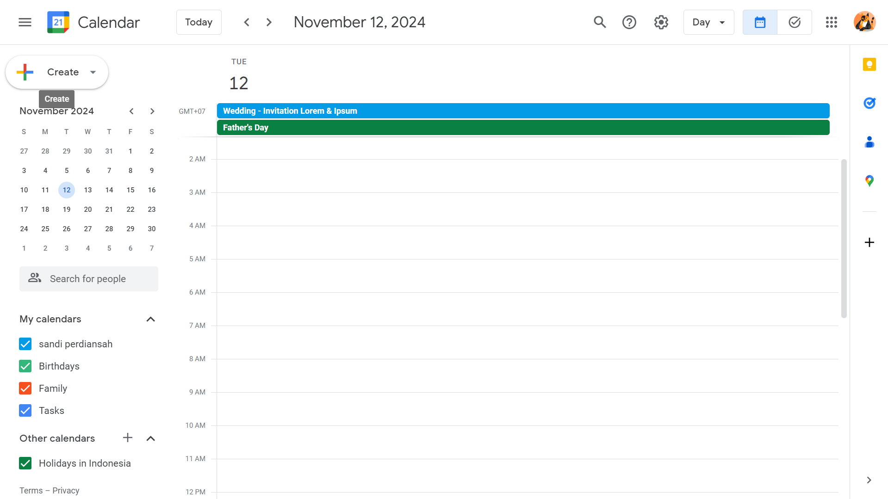
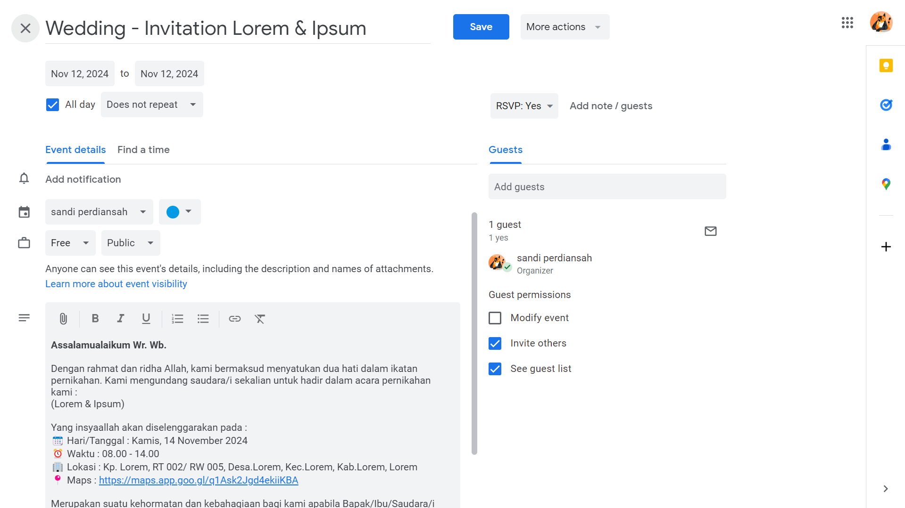
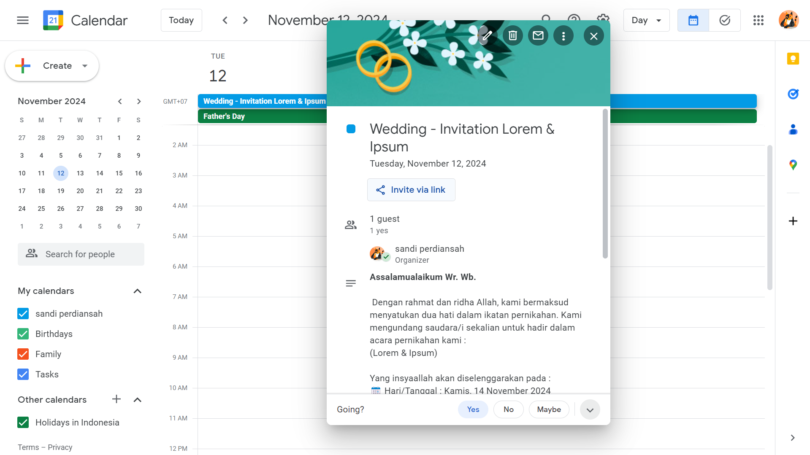

## Fitur ✨

- 📱 **Desain Responsif**: Dioptimalkan untuk berbagai ukuran layar.

## Teknologi yang Digunakan 🛠️

---

### Cara Mengedit `data.js` ✏️

- **Detail**: Perbarui nama pengantin, tanggal dan waktu pernikahan, serta alamat lokasi acara.
- **Tautan**:
    - 📅 **Kalender**: Tambahkan URL acara di Google Calendar. Buat acara, tambahkan judul dan deskripsi, lalu simpan. Klik "Bagikan" untuk mendapatkan tautan yang dapat dibagikan.

  
  
  

    - 📍 **Peta**: Masukkan URL lokasi acara dari Google Maps.
- 🖼️ **Galeri**: Anda bisa menambahkan lebih dari 5 gambar, pastikan ukurannya dioptimalkan untuk web.
- 🎵 **Audio**: Ganti file audio default dan pastikan ukurannya optimal.

